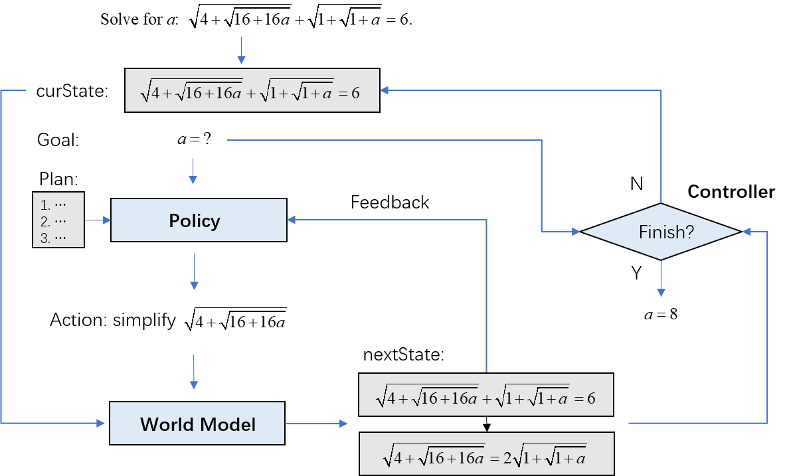
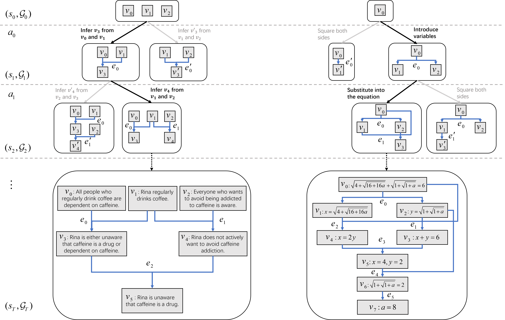

# MARS: Multi-Agent Reasoning System

This repo contains the code for multi-agent reasoning system for claim verification.

<p align="center">
  
</p>

<br>
<p align="center">
  
</p>


## Quick Start

Preparation:
```sh
# git clone this repo

cd MARS

pip install -r Requirements.txt
```

Inference:
```sh
cd src

# Test on entailment bank dataset
python main.py  --dataset entailment_bank --subset all --structure_check --output_dir ../results/test_entailment_bank_task2_gpt_4o_mini  --num_rollouts 32  --num_generations 3 --group_size 3 --beam_width 3 --cmp_per_opt 1 --visualize

# Test on new example
python main.py  --claim ../dataset/example_claim.txt --evidence ../dataset/example_evidence_statements.txt --structure_check --output_dir ../results/test_example_gpt_4o_mini  --num_rollouts 32  --num_generations 3 --group_size 3 --beam_width 3 --cmp_per_opt 1 --visualize

# Test on multiple sub claims
python main.py  --claim ../dataset/example_subclaims.txt --evidence ../dataset/example_evidence_statements.txt --multi_claim --structure_check --output_dir ../results/test_example_gpt_4o_mini  --num_rollouts 32  --num_generations 3 --group_size 3 --beam_width 3 --cmp_per_opt 1 --visualize
```

Auxiliary Functions:

```sh
# Create evidence statements from LMs
python create_evidence_with_LM.py --claim ../dataset/concrete_claim1.txt --model gpt-4o --output ../dataset/concrete_claim1_evidence_generated_with_gpt_4o.txt

# Transform evidence format with LMs
python evidence_format_transformation.py  --claim ../dataset/uhpc0_claim.txt --evidence ../dataset/uhpc0_evidence_document.txt --model gpt-4o --output ../dataset/uhpc0_evidence_extracted_with_gpt_4o.txt
```

### Parameters:
`--claim`: Path to the claim file.

`--evidence`: Path to the evidence file.


### API:
By default, the system uses the OpenAI API. Please add your own openAI API token as `openai_API_default` at the beginning of `utils.py`. No local models are used unless explicitly configured (No GPU is needed).


### Input:
`claim`: A single statement requiring verification.

`evidence`: A list of statements retrieved from a corpus to support or refute the claim.


### Output:
Each result is saved as a JSON file named `<example_id>.json`, which records the entailment graph and intermediate search results.


#### JSON Fields:
- `claim_veri_question`: Contains the claim and supporting evidence.
- `claim_veri_answer`: The ground truth verification label (`supported` / `refuted` / `not enough evidence`).
- `id`: The unique identifier for the sample.
- `rollout`: A list of search trajectories, each corresponding to an entailment graph.
- `flag_correct`: Boolean flag indicating whether the final result from the selected entailment graph is correct.
- `final_graph`: The final selected entailment graph that explicitly shows the reasoning process.

#### Fields for Each Trajectory:
- `active`: Boolean flag indicating whether this trajectory is active (only one trajectory remains active at the end).
- `prompt`: The current state of the entailment graph.
- `num_gen`: The number of generations for the next step.
- `responses`: The generated responses for the next step.
- `futures`: Future steps corresponding to each generation.
- `state_search_history`: The recorded search history for state exploration.


Each trajectory follows the predefined keyword sequence:

"Goal", "Initial state", "Initial graph", "Action 1", "State 1", "Graph 1", "Action 2", "State 2", "Graph 2", ..., "Final answer".

For each graph, include two parts:

1. "Statement": Key statements represented as "s1", "s2", "s3", ...".

2. "Entailment": The entailment relationship for each statement. The relationship must be one of the following:
   - "Evidence",
   - "Assumption",
   - A list of previous statements (e.g., ["s1", "s2"]) that logically lead to the current statement.
